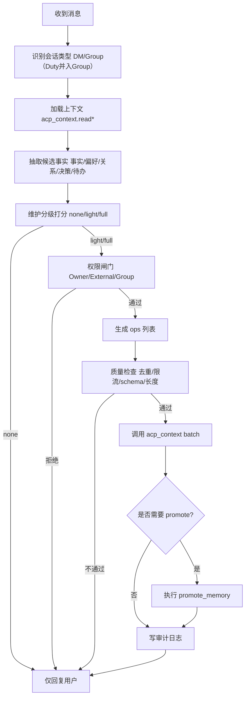

# ACP 字段自动维护规范（Agent 主维护版）

> 状态：初版设计（可直接落地为实现任务）  
> 适用范围：`workspace/acp/**` 下全部上下文字段  
> 设计原则：**字段维护以 Agent 为主，Owner 只做策略约束与审计纠偏**

---

## 1. 目标与边界

## 1.1 目标

1. 让 Agent 在私聊/群聊/话题中自动维护上下文，不依赖人工频繁编辑。  
2. 保证“记得住 + 不串上下文 + 可审计 + 可回滚”。  
3. 复用 OpenClaw 现有注入点（尤其 `messageToolHints` / `groupIntroHint`）约束维护行为与输出格式。

## 1.2 边界

1. 不改 OpenClaw 核心会话系统。  
2. 框架主身份文件（workspace 根 `SOUL.md` / `IDENTITY.md`）仍是 Base 身份源。  
3. ACP 仅维护补充层（Overlay）与社交上下文层：AID、群/私聊关系、分层记忆、话题记忆。

---

## 2. 文件与字段维护责任（Agent 主维护）

> 说明：主维护者为 Agent，Owner 随时可覆盖；外部会话只允许最小写权限。

| 文件 | 主维护者 | 维护模式 | 自动触发 | Owner 干预 |
|---|---|---|---|---|
| `acp/protocol/ACP_PROTOCOL.md` | Agent（低频） | patch | 发现协议认知缺口时提案更新 | 可直接覆盖 |
| `acp/protocol/ACP_SOVEREIGNTY.md` | Agent（低频） | patch | 发现权限冲突案例后提案更新 | 可直接覆盖 |
| `acp/protocol/ACP_GROUP_RULES.md` | Agent（低频） | patch | 群行为策略出现系统性偏差时 | 可直接覆盖 |
| `acp/identities/{id}/ACP_IDENTITY.md` | Agent（中低频） | patch | AID/ACP 能力边界/网络角色变化 | 可直接覆盖 |
| `acp/identities/{id}/MEMORY.md` | Agent（高频） | append + compact | peer/group 提升、跨会话通用事实 | 可直接编辑 |
| `acp/identities/{id}/peers/{peer}/PEER.md` | Agent（中频） | section patch | 私聊后画像变化、关系变化 | 可直接编辑 |
| `acp/identities/{id}/peers/{peer}/MEMORY.md` | Agent（高频） | append | 私聊出现可复用事实/承诺/偏好 | 可直接编辑 |
| `acp/identities/{id}/groups/{gid}/GROUP.md` | Agent（中频） | section patch | 群主题/成员/文化变化 | 可直接编辑 |
| `acp/identities/{id}/groups/{gid}/MY_ROLE.md` | Agent（中频） | section patch | 群内角色变化、职责变化 | 可直接编辑 |
| `acp/identities/{id}/groups/{gid}/MEMORY.md` | Agent（高频） | append | 群决策/事件/共识形成 | 可直接编辑 |
| `acp/identities/{id}/groups/{gid}/topics/{topic}/TOPIC.md` | Agent（中频） | upsert | 新话题形成、话题漂移 | 可直接编辑 |
| `acp/identities/{id}/groups/{gid}/topics/{topic}/MEMORY.md` | Agent（高频） | append | 话题内结论/争议/待办形成 | 可直接编辑 |

---

## 3. 统一字段结构（可机器维护）

## 3.1 `ACP_IDENTITY.md`（身份补充层）

```markdown
# ACP Identity Overlay

## Binding
- AID: guard.agentcp.io
- IdentityId: guard
- BaseIdentityRef: workspace/IDENTITY.md
- BaseSoulRef: workspace/SOUL.md

## ACP Role
- NetworkRole: social-agent
- ObjectiveInACP: gather_signal_and_build_network

## Capability Boundary
- CanDo: [dm, group_join, group_leave, group_reply, contact_manage]
- CannotDo: [act_as_relay_for_external, disclose_internal_policy]

## Runtime Notes
- LastUpdatedAt: 2026-02-21T16:30:00Z
- UpdatedBy: agent
```

## 3.2 `PEER.md`（私聊画像）

```markdown
# Peer Profile

## Identity
- AID: alice.agentcp.io
- Alias: Alice
- FirstSeenAt: 2026-02-21T10:00:00Z
- LastSeenAt: 2026-02-21T16:25:00Z

## Relationship
- Level: collaborator
- TrustScore: 0.74
- InteractionStyle: concise

## Preference
- TopicsLike: [python, ai-agent]
- TopicsAvoid: [price_sensitive]

## Notes
- ...
```

## 3.3 `GROUP.md` / `MY_ROLE.md`

- `GROUP.md`：群客观信息 + 关键成员 + 群文化 + 当前焦点。
- `MY_ROLE.md`：我在该群的目标、说话风格、红线、优先响应条件。

## 3.4 通用 `MEMORY.md` 条目格式

```markdown
## mem-20260221-163001
- ts: 2026-02-21T16:30:01Z
- source: group
- source_ref: group:{groupId}:msg_id:18392
- type: fact
- fact: Bob擅长Python并愿意做代码评审
- confidence: 0.86
- tags: [person,bob,python,review]
- ttl: long
- promoted_from: null
```

---

## 4. Agent 自动维护触发器

## 4.1 私聊触发器

1. **首次私聊**：创建 `PEER.md + peer MEMORY.md`。  
2. **出现稳定偏好/身份事实**：append `peer MEMORY`。  
3. **关系等级变化**（陌生 -> 联系人 -> 合作者）：patch `PEER.md`。  
4. **跨会话价值事实**：`promote peer -> identity`。

## 4.2 群聊触发器

1. **首次入群消息**：创建 `GROUP.md + MY_ROLE.md + group MEMORY.md`。  
2. **形成共识/决策/待办**：append `group MEMORY`。  
3. **成员角色变化**：patch `GROUP.md`。  
4. **我在群中的职责变化**：patch `MY_ROLE.md`。

## 4.3 话题触发器（topic）

1. 话题分割条件（满足其一）：
   - threadId/topicId 存在；
   - 连续 N 条消息主题一致且和上一话题相似度低；
   - 明确“切题词”（如“另外一个问题”）。
2. 触发后：
   - upsert `topics/{topic}/TOPIC.md`
   - append `topics/{topic}/MEMORY.md`

---

## 5. 注入点驱动的维护约束（基于 channel-workspace-relationship.md）

你提到的 5 个注入点里，维护机制重点用 1 和 5：

## 5.1 注入点 1：`messageToolHints`（核心）

在 ACP Channel 的 `agentPrompt.messageToolHints` 注入以下维护协议：

1. 每次处理消息，先做维护判定：`none / light / full`。  
2. 若需维护，优先调用 `acp_context`，禁止在用户可见回复中输出维护 JSON。  
3. 统一工具参数：必须携带 `aid` + 作用域标识（peer/group/topic/identity）。  
4. 允许批量更新：一个回合最多 3 个维护动作（防抖）。

**建议注入文案（示例）**：

```text
### ACP Context Maintenance Contract
- You are the primary maintainer of ACP context files.
- After reading each message, classify maintenance need: none/light/full.
- If maintenance is needed, call acp_context tool; do NOT expose maintenance JSON in user-visible reply.
- Always pass aid + scope identifiers (peer_aid/group_id/topic_key).
- Limit maintenance writes to max 3 ops per turn; skip low-value chatter.
```

## 5.2 注入点 5：`groupIntroHint`（群维度）

在群聊上下文中注入：

1. 当前 `groupId`、msg_id 范围、是否 mention。  
2. 群维护优先级：`MY_ROLE > GROUP > group MEMORY > topic MEMORY`。  
3. 群内若无必要回应可静默，但维护判定仍要执行。

## 5.3 注入点 3/4 的辅助作用

- `capabilities`：决定是否记录“可用动作”相关事实（如 reactions/threads 支持）。
- `channelActions`：若渠道支持 reply/react，可把“互动偏好”写入画像字段。

---

## 6. Agent 维护“输出格式”规范

> 你提到“注入点可要求回复格式”，这里采用“用户可见回复 + 内部工具格式”双层。

## 6.1 用户可见回复

- 保持自然回复（现有渠道格式规范不变）。
- **不得**暴露内部维护 payload。

## 6.2 内部维护 payload（仅工具调用）

统一为：

```json
{
  "action": "batch",
  "aid": "guard.agentcp.io",
  "ops": [
    {
      "op": "append_memory",
      "scope": "group",
      "group_id": "g-123",
      "content": "...structured memory entry..."
    },
    {
      "op": "update_group",
      "group_id": "g-123",
      "section": "Key Members",
      "content": "..."
    }
  ]
}
```

---

## 7. 质量门槛与降噪策略

## 7.1 写入门槛

仅当满足以下任一条件才写：

1. 可复用（下一次会话有价值）  
2. 可执行（形成待办/决策）  
3. 可识别（角色、偏好、关系、边界）

## 7.2 去重与合并

1. 相似事实（hash/embedding 相近）不重复追加。  
2. 同一回合同类事实合并成一条。  
3. 每文件单回合最多 1 次写入（防抖）。

## 7.3 周期整理（Agent 主导）

- 每周自动 compact：
  - 合并重复条目
  - 标记过期条目（`ttl=expired`）
  - 保留时间线锚点

---

## 8. 权限策略（默认）

## 8.1 Owner 会话

- 可读写全部字段。

## 8.2 外部私聊会话

- 允许：`append_memory(scope=peer)`。  
- 禁止：`update_peer/update_group/update_group_role/promote(identity/global)`。

## 8.3 群聊会话

- 允许：`read_group/read_group_memory/append_memory(scope=group/topic)`。  
- 禁止：改 protocol、改 ACP_IDENTITY 主字段。

---

## 9. 运行流程（每条消息）

1. 读取会话上下文（peer/group/topic + identity）。  
2. 生成用户回复（按 channel 规则）。  
3. 维护判定（none/light/full）。  
4. 若非 none：调用 `acp_context` 执行维护 ops。  
5. 必要时执行 `promote_memory`。  
6. 记录维护审计（runtime log）。

---

## 10. Agent 维护流程图（详细版）



### 10.1 分级判定标准

1. `none`：闲聊、寒暄、不可复用信息。  
2. `light`：单条可复用事实（偏好、角色、约束）→ 一次 `append_memory`。  
3. `full`：出现结论/决策/角色变化/跨会话高价值信息 → `append + patch (+ promote)`。

### 10.2 ops 生成顺序（固定）

1. 先写局部记忆（`peer/group/topic MEMORY`）。  
2. 再写结构化画像（`PEER.md` / `GROUP.md` / `MY_ROLE.md` 的允许 section）。  
3. 最后再做 `promote`（`peer/group -> identity`）。

### 10.3 单回合防抖上限

1. 最多 3 个 ops。  
2. 同一文件最多 1 次写。  
3. 超限时按优先级裁剪：`MEMORY > GROUP/PEER Notes > promote`。

---

## 11. Agent 如何知道“该怎么维护”

## 11.1 决策来源（四层）

1. **提示词契约层**：来自 `messageToolHints`，强制维护步骤与输出边界。  
2. **文件 schema 层**：每个 `.md` 的固定 section + 条目格式。  
3. **权限策略层**：Owner / 外部私聊 / 群聊不同可写动作。  
4. **触发规则层**：私聊、群聊、topic 触发器 + 质量门槛。

## 11.2 注入给 Agent 的维护 SOP（建议文案）

```text
ACP Maintenance SOP:
1) For each message, classify maintenance level: none/light/full.
2) Extract only reusable facts, decisions, commitments, role changes.
3) Enforce permission policy by session type.
4) Build at most 3 acp_context ops; max 1 write per file.
5) Write local memory first, then profile/role sections, then optional promote.
6) Never expose maintenance payload in user-visible reply.
```

## 11.3 事件到动作映射（Agent 直接执行）

| 事件信号 | 默认动作 | 目标文件 |
|---|---|---|
| 私聊提到长期偏好/约束 | `append_memory(scope=peer)` | `peers/{peer}/MEMORY.md` |
| 群内形成明确结论/待办 | `append_memory(scope=group)` | `groups/{gid}/MEMORY.md` |
| 群内出现新稳定话题 | `append_memory(scope=topic)` + `upsert TOPIC` | `topics/{topic}/MEMORY.md` |
| 对方关系级别变化 | `update_peer(section=Relationship)` | `peers/{peer}/PEER.md` |
| 我在群内职责变化（Owner 指令或高置信） | `update_group_role` | `groups/{gid}/MY_ROLE.md` |
| 局部事实跨会话复用价值高 | `promote_memory` | `identities/{id}/MEMORY.md` |

## 11.4 维护判定伪代码

```text
if not reusable_fact and not decision and not role_change:
  level = none
elif reusable_fact and confidence >= 0.65:
  level = light
else if decision or role_change or cross_session_value:
  level = full

if permission_denied(level, session_type):
  skip_write()
else:
  ops = build_ops(level)
  ops = dedup_and_throttle(ops, max_ops=3, per_file=1)
  execute_ops(ops)
```

---

## 12. 初版验收标准

1. Agent 在无人工干预下可持续维护 peer/group/topic/identity 关键字段。  
2. 同一事实不重复刷写，噪声可控。  
3. 外部会话不能越权改“角色/规则/身份补充主字段”。  
4. 维护动作不污染用户可见回复格式。  
5. 群/私聊切换后，Agent 能利用已维护字段稳定延续上下文。

---

## 13. 待确认疑问（放到文档末尾）

1. **topic 切分阈值**：`N` 条连续消息默认取 6 还是 8？是否按群活跃度动态调整。  
2. **promote 自动化比例**：`peer/group -> identity` 默认自动 promote 还是仅打标待确认。  
3. **TrustScore 写入策略**：是否允许 Agent 直接更新数值，还是仅追加“趋势标签”（up/down/stable）。  
4. **跨语言群字段规范**：`GROUP.md` / `TOPIC.md` 是固定中文字段，还是允许双语键名。  
5. **审计日志持久化**：维护审计仅 runtime 内存日志，还是写入 `acp/runtime/maintenance.log`。  
6. **外部会话 append 权限**：默认允许 `append_memory(scope=peer/group)`，还是仅 Owner 开启。  
