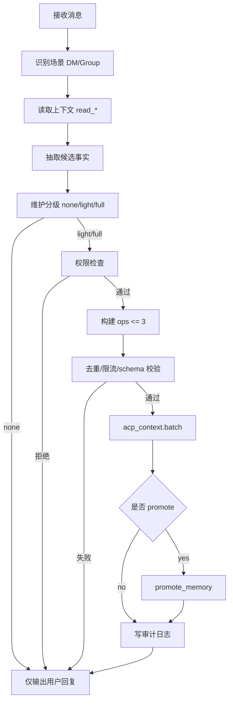

# Agent 自动维护流程与注入约束实现清单

> 目标：把“Agent 如何知道该维护什么”落到可实施流程，且不污染用户可见回复

## 1. 核心机制

1. 每条消息执行“回复流程 + 维护流程”双轨。  
2. 维护流程由注入点提供 SOP 约束。  
3. 维护动作走 `acp_context` 工具，不在用户回复中暴露内部 payload。

## 2. 流程图（落地版）

## 3. 注入点实现任务

### 3.1 `messageToolHints`（必须）

代码落点：`src/channel.ts`

任务：
1. 加入 ACP Maintenance SOP 注入文案。  
2. 明确要求：
   - 先判定 `none/light/full`
   - 维护 payload 不得出现在用户回复
   - 每回合最多 3 ops
   - 强制带 `aid + scope id`。

### 3.2 `groupIntroHint`（群增强）

代码落点：群上下文构建路径（目前在 monitor/group 处理链）

任务：
1. 注入群维护优先级：`MY_ROLE > GROUP > group MEMORY > topic MEMORY`。  
2. 注入群上下文标识：`groupId/msg_id/mention`。  
3. 明确“可静默回复但不可跳过维护判定”。

### 3.3 `capabilities` / `channelActions`（辅助）

任务：
1. 若 channel 支持 threads/reactions，把相关偏好可写入 `GROUP.md`/`TOPIC.md`。  
2. 不把 channel 能力误写成永久人格约束。

## 4. 判定器实现任务（Maintenance Classifier）

建议新增：`src/context-maintenance.ts`

提供：
1. `classifyMaintenanceNeed(message, context): none|light|full`  
2. `extractCandidateFacts(message, context): Fact[]`  
3. `buildMaintenanceOps(facts, scope, permissions): Ops[]`。

判定阈值（初版）：
1. `confidence < 0.65` 且无决策/承诺 => `none`  
2. 单条可复用事实 => `light`  
3. 决策/关系变化/跨会话高价值 => `full`

## 5. 维护动作执行策略

1. 顺序固定：`local memory -> profile/role patch -> promote`。  
2. 同文件单回合只写一次。  
3. 超限裁剪优先级：`memory > profile notes > promote`。  
4. 执行失败不阻断用户回复。

## 6. 用户可见回复约束

1. 回复内容不出现“我正在更新文件/我写入了记忆”等内部描述。  
2. 禁止输出工具 payload JSON。  
3. 若用户主动问“你记住了吗”，可自然语言回答，不暴露内部路径。

## 7. 完成标准

1. Agent 能稳定执行“回复 + 维护”双轨。  
2. 维护行为符合注入 SOP，且不污染用户输出格式。  
3. 维护写入频率可控，不出现刷写风暴。
