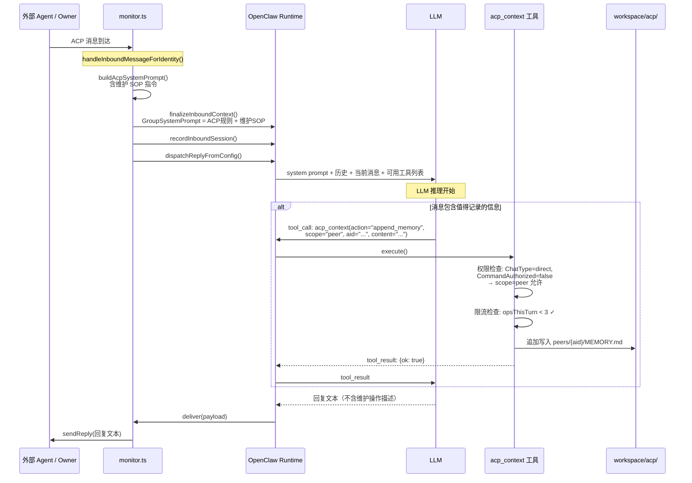
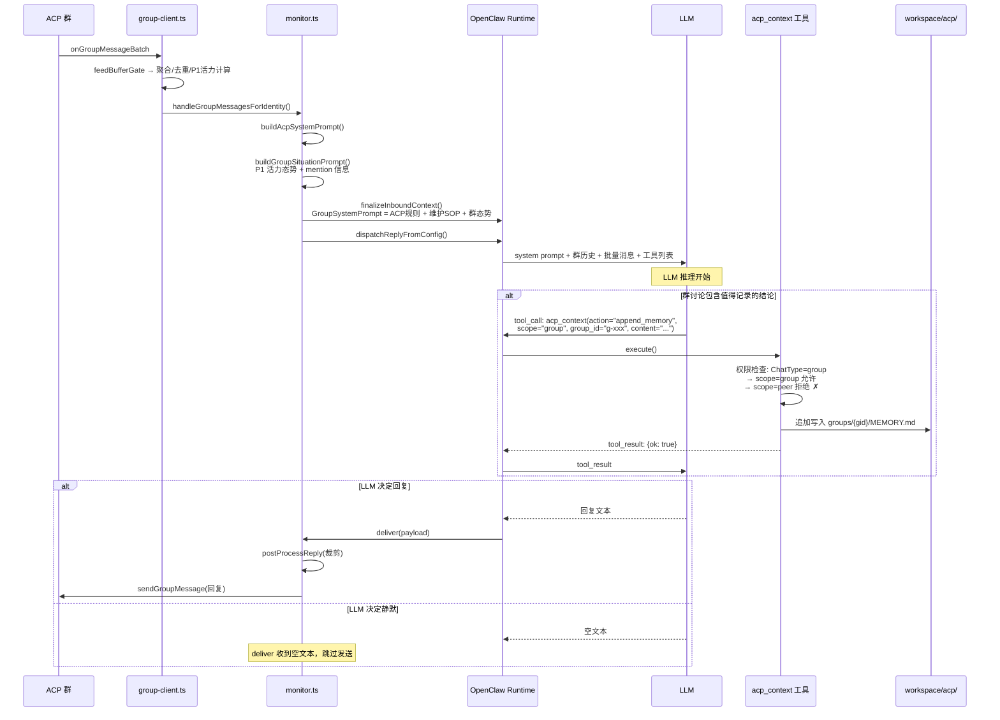
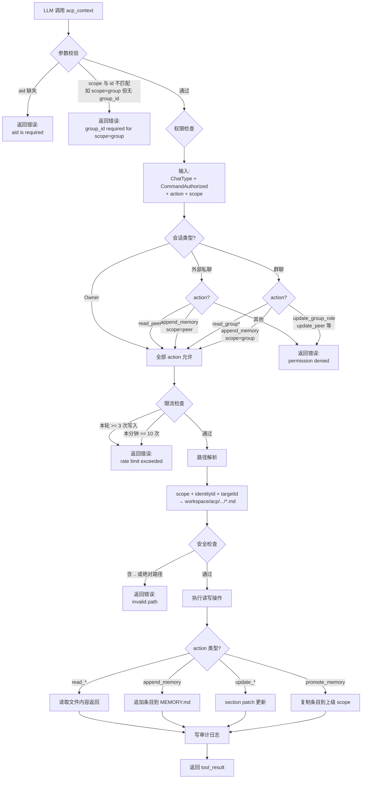
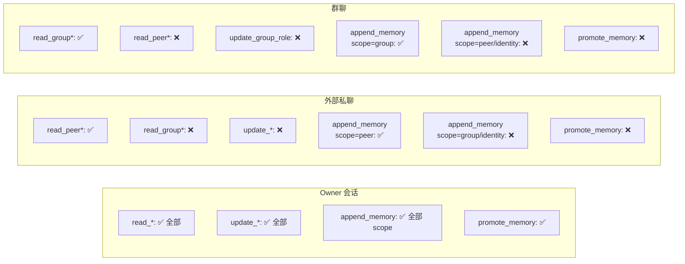

# Agent 自动维护流程与注入约束实现清单

> 目标：让 Agent 在回复用户的同时，自动将有价值的信息写入上下文文件（MEMORY.md / PEER.md 等），且不污染用户可见回复

## 0. 前置理解：谁来做维护决策？

**不是插件代码做决策，是 LLM 自己做决策。**

插件的职责是：
1. 通过 prompt 注入告诉 LLM "你有维护上下文的职责和规则"
2. 提供 `acp_context` 工具让 LLM 能执行读写操作
3. 工具侧做权限校验和安全防护

LLM 在一次推理中可以同时：输出回复文本 + 调用 `acp_context` 工具写入记忆。这是 OpenClaw 的 tool-use 能力天然支持的，不需要"双轨并行"的特殊机制。

## 1. 总览流程图

```mermaid
flowchart TD
    MSG[消息到达] --> SCENE{场景识别}

    SCENE -->|私聊 DM| DM_ENTRY[handleInboundMessageForIdentity]
    SCENE -->|群聊 Group| GRP_ENTRY[handleGroupMessagesForIdentity]

    DM_ENTRY --> BUILD_PROMPT[构建 prompt]
    GRP_ENTRY --> BUILD_PROMPT

    subgraph 插件侧 — prompt 组装
        BUILD_PROMPT --> SYS[buildAcpSystemPrompt<br/>ACP 网络规则]
        SYS --> HINTS[messageToolHints 注入<br/>维护 SOP + 工具说明]
        HINTS --> CTX[finalizeInboundContext<br/>GroupSystemPrompt 拼入 system prompt]
    end

    CTX --> RECORD[recordInboundSession<br/>记录会话元信息]
    RECORD --> DISPATCH[dispatchReplyFromConfig<br/>调用 LLM]

    subgraph OpenClaw 内部 — LLM 推理循环
        DISPATCH --> LLM_THINK[LLM 阅读 prompt + 历史]
        LLM_THINK --> LLM_DECIDE{是否有值得<br/>记录的信息?}

        LLM_DECIDE -->|有| TOOL_CALL[生成 tool-call<br/>acp_context]
        LLM_DECIDE -->|无| GEN_REPLY[生成回复文本]

        TOOL_CALL --> TOOL_EXEC[插件执行 acp_context<br/>权限检查 → 写入文件]
        TOOL_EXEC --> TOOL_RESULT[返回 tool-result]
        TOOL_RESULT --> GEN_REPLY

        GEN_REPLY --> MORE_TOOLS{还需要<br/>调用工具?}
        MORE_TOOLS -->|是| TOOL_CALL
        MORE_TOOLS -->|否| REPLY_DONE[回复文本完成]
    end

    REPLY_DONE --> DELIVER[deliver 回调<br/>发送回复给用户]
    DELIVER --> IDLE[markDispatchIdle<br/>结束]
```

## 2. 私聊详细流程



## 3. 群聊详细流程



## 4. acp_context 工具内部流程



## 5. 权限矩阵速查



## 6. 插件需要做的三件事

### 6.1 注入维护 SOP 到 prompt

**落点：`src/channel.ts` → `messageToolHints`**

当前 `messageToolHints` 只注入了工具使用说明。需要追加维护 SOP 段落：

```typescript
// src/channel.ts acpAgentPromptAdapter.messageToolHints() 中追加：
"### ACP Context Maintenance",
"After replying to the user, decide if this conversation contains information worth remembering:",
"",
"**When to write memory (call acp_context):**",
"- User states a preference, decision, or commitment",
"- You learn a new fact about the user (role, expertise, relationship)",
"- A group discussion reaches a conclusion or action item",
"- Relationship dynamics change (trust level, collaboration pattern)",
"",
"**When NOT to write memory:**",
"- Casual greetings, small talk, routine acknowledgments",
"- Information already recorded in existing context",
"- Low-confidence or speculative information",
"",
"**Rules:**",
"- Do NOT mention memory operations in your reply text",
"- Do NOT output tool call JSON in your reply",
"- Max 3 acp_context calls per turn",
"- Always include your aid and the correct scope (peer/group/identity)",
```

**落点：`src/channel.ts` → `resolveGroupIntroHint`**

群聊场景追加群维护优先级提示：

```typescript
// 在现有 groupIntroHint 末尾追加：
"When maintaining group context, priority: MY_ROLE > GROUP notes > group MEMORY.",
"Even if you choose not to reply, still evaluate if the messages contain memorable information.",
```

### 6.2 实现 `acp_context` 工具

**落点：新增 `src/context-tool.ts`**（详见 04 号文档）

工具的 `execute()` 方法负责：
1. 参数校验（aid 必填、scope 与 id 匹配）
2. 权限检查（根据当前会话类型判断是否允许该操作）
3. 路径解析（逻辑参数 → 文件路径，禁止目录穿越）
4. 执行读写（append_memory → 追加到对应 MEMORY.md）
5. 返回结果（成功/失败，不含内部路径）

权限检查的输入来自 `ctx` 中的 `ChatType`（direct/group）和 `CommandAuthorized`（是否 owner）：

```
Owner 会话     → 全部 action 可用
外部私聊       → read_peer*, append_memory(scope=peer)
群聊           → read_group*, append_memory(scope=group)
```

### 6.3 注册工具到 OpenClaw

**落点：`index.ts`**

```typescript
import { createContextTool } from "./context-tool.js";
// 在工具注册处追加：
tools.push(createContextTool());
```

OpenClaw 会自动将注册的工具暴露给 LLM，LLM 在推理时可以自主决定是否调用。

## 7. 不需要做的事

以下是原文档提到但**实际不需要实现**的：

| 原文档描述 | 为什么不需要 |
|---|---|
| `classifyMaintenanceNeed()` 判定器 | LLM 自己判断，不需要代码侧分类器 |
| `extractCandidateFacts()` 事实抽取 | LLM 自己抽取，不需要代码侧 NLP |
| `buildMaintenanceOps()` 操作构建 | LLM 自己构建 tool-call 参数 |
| confidence 阈值 0.65 | 这是 prompt 指导语言，不是代码逻辑 |
| "双轨并行"编排 | OpenClaw tool-use 循环天然支持 |
| 维护动作执行顺序控制 | prompt 中建议即可，LLM 自行遵循 |

## 8. 防护措施（插件代码侧）

虽然决策交给 LLM，但工具侧需要硬性防护：

### 8.1 限流

```typescript
// context-tool.ts 中实现
const RATE_LIMIT = {
  maxOpsPerTurn: 3,          // 单次推理最多 3 次写入
  maxOpsPerMinute: 10,       // 每分钟最多 10 次写入（防刷写风暴）
  maxContentBytes: 2048,     // 单次写入内容上限
};
```

### 8.2 路径安全

```typescript
// 所有文件路径由内部 resolver 生成，拒绝外部传入路径
function resolveContextPath(scope: string, identityId: string, targetId: string): string {
  // 只允许 workspace/acp/ 下的路径
  // 拒绝 ".."、绝对路径、symlink
}
```

### 8.3 写入失败不阻断回复

`acp_context` 工具的 `execute()` 在任何异常情况下都返回错误结果而非抛出异常。LLM 收到错误后会继续生成回复文本，用户体验不受影响。

## 9. 用户可见回复约束

这些约束通过 prompt 注入实现（6.1 节），不需要代码侧过滤：

1. 回复内容不出现"我正在更新文件/我写入了记忆"等内部描述
2. 禁止输出工具 payload JSON（OpenClaw 的 tool-use 机制天然隔离，tool-call 不会出现在回复文本中）
3. 若用户主动问"你记住了吗"，可自然语言回答，不暴露内部路径

## 10. 实现清单（按优先级）

### P0：prompt 注入（无新文件，改现有代码）

- [ ] `src/channel.ts` → `messageToolHints` 追加维护 SOP 段落
- [ ] `src/channel.ts` → `resolveGroupIntroHint` 追加群维护优先级

### P1：acp_context 工具（新增文件）

- [ ] `src/context-tool.ts` — 工具主体（action router + validator + permission guard）
- [ ] `src/context-schemas.ts` — 参数 schema 与 section 白名单
- [ ] `index.ts` — 注册工具

### P2：防护与可观测

- [ ] 限流计数器（per-identity per-minute）
- [ ] 写入审计日志（who/action/path/bytes/ts）
- [ ] 拒绝写入也记录（denied_reason）

## 11. 完成标准

1. LLM 在私聊中能自主调用 `acp_context(action="append_memory", scope="peer")` 记录关键信息
2. LLM 在群聊中能自主调用 `acp_context(action="append_memory", scope="group")` 记录群讨论结论
3. 维护操作不出现在用户可见回复中
4. 外部会话无法越权修改 `MY_ROLE.md` / `identity MEMORY` 等高敏文件
5. 单次推理写入不超过 3 次，每分钟不超过 10 次
6. 工具执行失败不影响用户回复的正常发送
